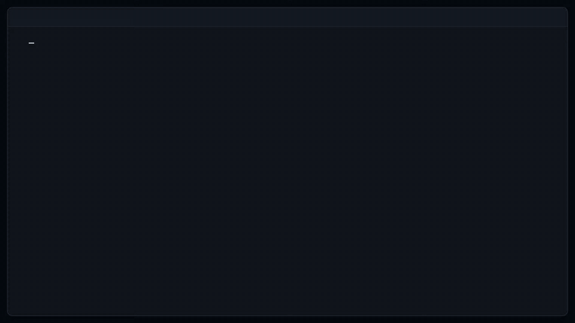
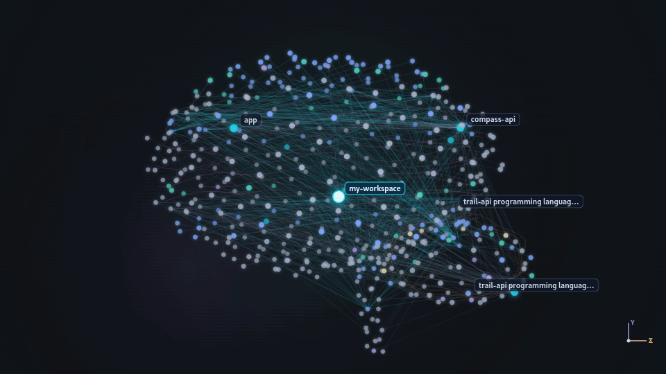

# Workspai CLI

[](https://www.npmjs.com/package/workspai)
[](https://www.npmjs.com/package/workspai)
[](https://github.com/chistiq/workspai/actions/workflows/ci.yml)
[](LICENSE)
[](https://marketplace.visualstudio.com/items?itemName=rapidkit.rapidkit-vscode)

## Give your AI agent the system, not just the repository

**Your AI coding agent wastes time guessing your project structure. Workspai fixes that.**

> One workspace. One truth. Humans and AI aligned.

## Workspace Intelligence for software systems

Workspai is an open-source CLI that gives people and AI tools one governed view
of the software system they are changing.

```bash
npx workspai adopt .
npx workspai workspace intelligence run --for-agent generic
```

Two commands. Your project gains a bounded, evidence-backed system view:

| Before Workspai                              | After Workspai                                        |
| -------------------------------------------- | ----------------------------------------------------- |
| Agent scans thousands of files for context   | Agent starts from bounded entry and context artifacts |
| No dependency map between services           | Searchable graph with source-level proof              |
| Broken test blocks release, no one knows why | Doctor localizes the blocker and next target          |
| Every AI session starts from scratch         | Sessions resume from durable evidence                 |

Here is what you get:

| What it produces | Why it matters |
| --- | --- |
| **Workspace Model** | A canonical inventory of registered projects, detected runtimes, frameworks, and proven dependencies |
| **Knowledge Graph** | Searchable relationships between projects, backed by source-level proof |
| **Health & Readiness** | Doctor checks, verification gates, and release posture based on evidence, not guesses |
| **Agent Grounding** | Focused context, rules, and operational Skills for supported agent hosts |
| **MCP Server** | Versioned read-oriented tools for querying evidence, graph, blockers, and context live |

`generic` is the portable default: one canonical context, plus lightweight
adapters for every supported agent host without rebuilding the Model or
Graph per provider.

### What the output looks like

The canonical workspace owns the Model, Graph, context, evidence index, and
Skills. Each linked project keeps only its portable entry, scoped context, and
workspace binding:

```text
your-workspace/
├── .workspai/
│   ├── reports/                       # Model, Graph, verification, context
│   └── skills/                        # evidence-derived playbooks
├── AGENTS.md · .codex/ · .cursor/ · .claude/ · .github/ · .agents/
└── project/.workspai/
    ├── agent-entry.v1.json            # portable project entry
    └── workspace-link.local.json      # machine-local binding
```

Your agent starts with the project's `agent-entry.v1.json`, resolves the canonical
workspace, and then reads compact project context before retrieving task-scoped
Graph evidence or targeted source.


[Get started](#start-with-your-software) ·
[How it works](#how-it-works) ·
[Documentation](packages/cli/docs/README.md)

## Start with your software

You do not need to move an existing project. Open its directory and adopt it:

```bash
cd /absolute/path/to/project
npx workspai adopt .
```

Workspai creates or reuses a minimal workspace in the default system location
and links the project to it. You can stay in the project directory:

```bash
npx workspai workspace intelligence run --for-agent generic --strict --json
```

This run builds the current system view, checks its evidence, and prepares
shared context for people and tools. Governed reports are saved in the resolved
canonical workspace under `.workspai/reports/`; the adopted project retains its
portable entry and scoped context locally.
When something is missing or blocked, Workspai reports it instead of claiming
the workspace is healthy. This canonical form gives CI, agents, and other
machine consumers strict gate semantics through the versioned JSON contract;
omit `--strict --json` for the shorter human-readable first run shown above.

Starting from scratch? Use the guided flow:

```bash
npx workspai create
```

It can create a workspace, scaffold a project, or add existing software.

## From intent to a verified change

Give the agent an outcome instead of an open-ended prompt:

```bash
npx workspai goal "Add retry with exponential backoff" --for-agent generic
```

The Goal binds intent, scope, acceptance criteria, and current architecture. It
prepares governed work; it does not edit source or claim completion. Polyglot
and multi-project automation can bind choices explicitly with `--runtime` and
`--scope`.

Before broad discovery, an agent can prove that it entered through current
canonical evidence:

```bash
npx workspai agent bootstrap --for-agent generic --strict --json
```

For source-changing work, Proof-Carrying Change extends that Goal into an
auditable lifecycle:

```text
Intent → baseline → authorization → effects → verification → sealed capsule
```

Start the Goal-bound transaction before the first source mutation:

```bash
npx workspai change begin --json
```

Prediction can guide the agent, but only authorized, observed effects and
independent verification can seal the capsule; the PCC guide contains the
complete executable loop.



[Goal Packs](packages/cli/docs/goal-packs.md) ·
[Proof-Carrying Change](packages/cli/docs/proof-carrying-change.md) ·
[Canonical-first agent entry](packages/cli/docs/agent-entry.md)

## How it works

```text
Code · APIs · packages · infrastructure · docs · CI · policies
                              │
                              ▼
                    Canonical Workspace Model
                              │
                              ▼
              Evidence-backed Knowledge Graph
                              │
                              ▼
          impact · doctor · verify · context · explain
                              │
                              ▼
             Developers · CI · IDEs · MCP · AI agents
```

The **Workspace Model is the canonical source of truth**. The Knowledge Graph is
a **derived, revision-bound representation** of that model. Providers can enrich
the graph with files, symbols, APIs, tests, infrastructure, ownership, and
proofs, but they do not rewrite the model during the same run.

A missing relationship means **not proven by current evidence**, not “these
projects are independent.”

The complete decision loop is versioned as a contract:

```text
Model → Diff → Impact → Doctor + Contract Verify + Analyze → Readiness
      → Verify → Context → Agent Sync → Explain
```

The model, graph, and verification chain run locally and do not require an AI
API key. AI providers are optional consumers of the same governed context.

### See the evidence-backed graph

The graph connects projects, APIs, packages, tests, infrastructure, ownership,
and runtime topology only when current evidence supports the relationship.
Search results and visual nodes retain their proof references; missing edges
remain unknown rather than being presented as independence.



[Query, explain, and export the graph](packages/cli/docs/workspace-knowledge-graph.md)

## One foundation, many consumers

- **Developers** get clear summaries, proof paths, and next actions.
- **CI** gets structured JSON and versioned evidence.
- **AI agents** get focused context instead of an unbounded repository dump.
- **IDEs and dashboards** read the same model, graph, and verification results.
- **MCP clients** can query current workspace evidence through versioned read-oriented tools via `workspace mcp serve`.
- **Live views** observe CLI and Studio activity without turning telemetry into proof.
- **Graph tools** can use JSON, JSON-LD, Mermaid, DOT, GraphML, or GEXF exports.

## Go deeper

| Goal                                              | Guide                                                                                     |
| ------------------------------------------------- | ----------------------------------------------------------------------------------------- |
| Learn the main concepts                           | [Plain-language glossary](packages/cli/docs/GLOSSARY.md)                                  |
| Create, adopt, or import software                 | [Creating workspaces and projects](packages/cli/docs/creating-workspaces-and-projects.md) |
| Query the graph and inspect proof                 | [Workspace Knowledge Graph](packages/cli/docs/workspace-knowledge-graph.md)               |
| Understand the full decision loop                 | [Workspace Intelligence runner](packages/cli/docs/workspace-intelligence-runner.md)       |
| Repair a governed blocker safely                  | [Workspace Repair Engine](packages/cli/docs/workspace-repair-engine.md)                   |
| Compile intent into a scope-bound agent handoff   | [Goal Packs](packages/cli/docs/goal-packs.md)                                             |
| Prove what an agent changed and why               | [Proof-Carrying Change](packages/cli/docs/proof-carrying-change.md)                       |
| Give every coding agent a canonical project entry | [Canonical-first agent entry](packages/cli/docs/agent-entry.md)                           |
| Observe current CLI and Studio activity           | [Workspai Live](packages/cli/docs/workspace-live-activity.md)                             |
| Integrate CI                                      | [CI workflows](packages/cli/docs/ci-workflows.md)                                         |
| Find a command or flag                            | [Command reference](packages/cli/docs/commands-reference.md)                              |
| Inspect schemas and artifact ownership            | [Artifact Catalog](packages/cli/docs/contracts/ARTIFACT_CATALOG.md)                       |

## Packages

- [`workspai`](packages/cli) - the published CLI.
- [`wspai`](packages/wspai) - an optional short npm alias.

## Develop

Read the [Development Guide](packages/cli/docs/DEVELOPMENT.md),
[Contribution Hub](.github/CONTRIBUTING.md),
[complete Contributing Guide](packages/cli/CONTRIBUTING.md), and
[README content contract](packages/cli/docs/README_CONTENT_CONTRACT.md).

## Community

Workspai is an open-source project by [Chistiq](https://chistiq.com/), the
intelligence infrastructure company behind RapidKit and Workspai.

- [Issues](https://github.com/chistiq/workspai/issues)
- [Start contributing](.github/CONTRIBUTING.md)
- [Discussions](https://github.com/chistiq/workspai/discussions)
- [Security policy](packages/cli/docs/SECURITY.md)
- [Changelog](packages/cli/CHANGELOG.md)

## License

MIT. See [LICENSE](LICENSE).
