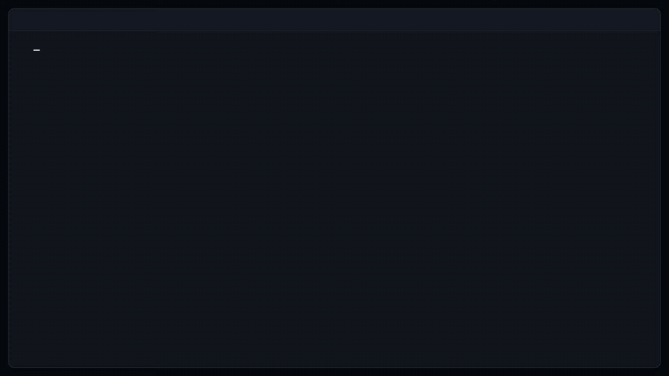
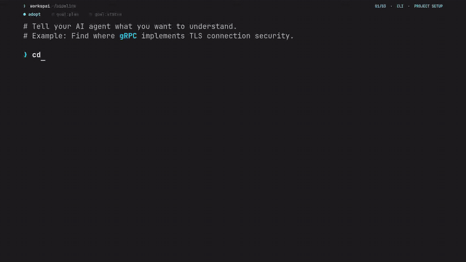

# Workspai CLI

[](https://www.npmjs.com/package/workspai)
[](https://www.npmjs.com/package/workspai)
[](https://github.com/chistiq/workspai/actions/workflows/ci.yml)
[](LICENSE)
[](https://marketplace.visualstudio.com/items?itemName=rapidkit.rapidkit-vscode)

## Give your AI agent the system, not just the repository

**Your AI coding agent wastes time guessing your project structure. Workspai fixes that.**

> One workspace. One truth. Humans and AI aligned.

## Workspace Intelligence for software systems

```bash
npx workspai adopt .
npx workspai workspace intelligence run --for-agent generic
```

Two commands. Your project becomes a fully understood workspace. Here is what changes:

### Before Workspai

- Your agent scans thousands of files looking for context
- No one knows which services depend on each other
- A broken test blocks release, but nobody knows which change caused it
- Every AI session starts from scratch

### After Workspai

- Your agent reads one bounded context file instead of the whole repo
- A searchable graph shows every dependency, backed by proof
- Doctor and verify name the broken test, the owning project, and the fix path
- Sessions resume from durable evidence, not guesswork

Here is what you get:

| What it produces | Why it matters |
| --- | --- |
| **Workspace Model** | A canonical inventory of every project, runtime, framework, and dependency |
| **Knowledge Graph** | Searchable relationships between projects, backed by source-level proof |
| **Health & Readiness** | Doctor checks, verification gates, and release posture based on evidence, not guesses |
| **Agent Context** | Bounded, focused instructions so AI tools read what they need, not the entire repo |
| **Agent Rules** | Ready-to-use grounding for Cursor, Copilot, Claude, Codex, Gemini, and more |
| **Agent Skills** | Runtime-, polyglot-, test-, and delivery-aware operational playbooks, with portable `SKILL.md` projections where the host supports Agent Skills |
| **MCP Server** | 14 read-oriented tools so MCP clients can query evidence, graph, blockers, and context live |

`generic` is the portable default: one canonical context, plus lightweight
adapters for every supported agent host without rebuilding the Model or
Graph per provider.

### What the output looks like

After a single run, `.workspai/` contains everything agents and CI need:

```text
your-workspace/                              # ── Workspace level (system-wide) ──
│
├── .workspai/
│   ├── workspace.json                       # workspace identity & profile
│   ├── workspace.contract.json              # project registry, ports, APIs, ownership
│   ├── workspace-registry.v1.json           # project count for UI/CI
│   ├── AGENT-GROUNDING.md                   # workspace-level agent grounding
│   ├── reports/                             # ── Intelligence artifacts ──
│   │   ├── workspace-model.json             # canonical model: projects, runtimes, deps
│   │   ├── workspace-knowledge-graph.json   # proof-backed relationships
│   │   ├── workspace-model-snapshot.json    # baseline for comparison
│   │   ├── workspace-model-diff-last-run.json   # structural changes since snapshot
│   │   ├── workspace-impact-last-run.json   # blast radius & affected projects
│   │   ├── doctor-last-run.json             # health check findings
│   │   ├── analyze-last-run.json            # code & config analysis
│   │   ├── workspace-contract-verify-last-run.json  # contract compliance
│   │   ├── release-readiness-last-run.json  # release gate status
│   │   ├── workspace-verify-last-run.json   # pass/fail per project with evidence
│   │   ├── workspace-context-agent.json     # bounded context for AI agents
│   │   ├── workspace-skills-index.json      # dynamic operational skills inventory
│   │   ├── workspace-explain-last-run.json  # human-readable diagnosis
│   │   ├── workspace-intelligence-run-last-run.json  # run metadata & chain status
│   │   ├── workspace-intelligence-history.json  # run history
│   │   ├── agent-customization-pack.json    # agent customization manifest
│   │   ├── workspai-mcp-design.json         # MCP tool design manifest
│   │   ├── INDEX.json                       # evidence inventory & read order
│   │   └── ...                              # evaluation, goal status, repair receipt
│   └── skills/                              # ── Generated operational skills ──
│       ├── workspai-diagnose-api-failure.md
│       ├── workspai-dependency-upgrade.md
│       ├── workspai-release-readiness.md
│       ├── workspai-safe-schema-migration.md
│       └── workspai-rename-contract.md
│       # runtime/test/delivery playbooks appear only when detected
│
│  # Workspace-level agent grounding (generated per host by agent-sync):
├── AGENTS.md                                # portable (Codex, Gemini, Qwen, etc.)
├── CLAUDE.md                                # Claude entry
├── GEMINI.md                                # Gemini entry
├── QWEN.md                                  # Qwen entry
├── .cursor/
│   ├── rules/
│   │   ├── workspai-grounding.mdc           # scope & intelligent loop
│   │   ├── workspai-evidence.mdc            # evidence discipline
│   │   ├── workspai-diagnose.mdc            # diagnose workflow
│   │   ├── workspai-repair.mdc              # repair workflow
│   │   └── workspai-release.mdc             # release workflow
│   └── skills/workspai-*/SKILL.md           # grounding + generated operational Skills
├── .claude/rules/
│   ├── workspai-workspace.md                # workspace scope & loop
│   └── workspai-evidence.md                 # evidence discipline
├── .windsurf/rules/
│   ├── workspai-grounding.md                # grounding
│   └── workspai-evidence.md                 # evidence discipline
├── .windsurfrules                           # legacy Windsurf support
├── .grok/rules/
│   ├── workspai-grounding.md                # grounding
│   └── workspai-evidence.md                 # evidence discipline
├── .amazonq/rules/
│   ├── workspai-workspace.md                # workspace scope
│   └── workspai-agent-entry.md              # agent entry
├── .github/
│   ├── copilot-instructions.md              # GitHub Copilot instructions
│   ├── instructions/workspai-*.md           # Copilot workspace/evidence
│   ├── prompts/workspai-*.prompt.md         # diagnose, repair, release prompts
│   ├── agents/workspai-*.agent.md           # advisor, repair, release agents
│   └── skills/workspai-*/SKILL.md           # grounding & intelligence skills
├── .agents/skills/workspai-*/SKILL.md       # generic agent skills
│
│  # ── Project level (repeated per project) ──
│
├── nova-api/
│   ├── .workspai/
│   │   ├── project.json                     # project identity & metadata
│   │   ├── workspace-link.local.json        # machine-local workspace binding
│   │   ├── agent-entry.v1.json              # canonical agent entry point
│   │   ├── PROJECT-GROUNDING.md             # project-level grounding
│   │   └── reports/
│   │       └── project-context-agent.json   # scoped project context
│   ├── AGENTS.md                            # project-level portable grounding
│   ├── CLAUDE.md                            # project-level Claude entry
│   ├── GEMINI.md                            # project-level Gemini entry
│   ├── QWEN.md                              # project-level Qwen entry
│   └── .amazonq/rules/workspai-agent-entry.md
│
└── summit-web/                              # (same structure per project)
```

Your agent reads `workspace-context-agent.json` at the workspace level for system-wide
awareness, then `agent-entry.v1.json` at the project level for scoped context. Two reads
instead of scanning thousands of files.



[Get started](#start-with-your-software) ·
[See what you get](#what-workspai-gives-you) ·
[How it works](#how-it-works) ·
[Documentation](packages/cli/docs/README.md)

## Why Workspai

Your codebase has projects, APIs, dependencies, infrastructure, tests, and
policies, but no single document that ties them together. Workspai creates that
document automatically.

- **See the whole system:** every project, service, and dependency in one model.
- **Ask with proof:** trace any answer back to the exact file and line that supports it.
- **Change safely:** know impact before you commit, verify after, and give AI agents
  only the context they need, not the entire repository.

[VS Code extension](https://marketplace.visualstudio.com/items?itemName=rapidkit.rapidkit-vscode)


## Start with your software

You do not need to move an existing project. Open its directory and adopt it:

```bash
cd /absolute/path/to/project
npx workspai adopt .
```

Workspai creates or reuses a minimal workspace in the default system location
and links the project to it. You can stay in the project directory:

```bash
npx workspai workspace intelligence run --for-agent generic --strict --json
```

This run builds the current system view, checks its evidence, and prepares
shared context for people and tools. Results are saved under `.workspai/`.
When something is missing or blocked, Workspai reports it instead of claiming
the workspace is healthy. This canonical form gives CI, agents, and other
machine consumers strict gate semantics through the versioned JSON contract;
omit `--strict --json` for the shorter human-readable first run shown above.

Starting from scratch? Use the guided flow:

```bash
npx workspai create
```

It can create a workspace, scaffold a project, or add existing software.

## Give your agent a goal, not an open-ended prompt

Describe the outcome in plain language from the adopted project:

```bash
npx workspai goal "Raise test coverage to 85%" --for-agent generic
# In a polyglot scope, choose interactively or bind a canonical runtime:
npx workspai goal "Raise test coverage to 85%" --runtime cpp --for-agent generic
# Or pursue feature, defect, refactor, performance, documentation, or
# system-understanding outcomes in the same governed flow.
npx workspai goal "Add retry with exponential backoff" --for-agent generic
```

Workspai turns it into a bounded, evidence-backed handoff:

```text
Intent → project scope → proof-backed context → governed plan → safe execution
```

The agent gets a focused objective, not permission to scan or change
everything. Workspai keeps approval, verification, and rollback under CLI
control. The command prepares governed work; it does not edit source or claim
that the outcome is complete. Exact coverage, dependency-security, and release
Goals have deterministic CLI verifiers; other outcomes retain CLI safety and
rollback while the consumer performs an evidence-backed outcome review.
Multi-project scope and polyglot runtime choices are explicit. Interactive
users get bounded choices from the canonical Workspace Model; automation gets
a machine-readable decision and can use `--scope` and `--runtime`.



[Learn how Goal Packs work](packages/cli/docs/goal-packs.md)

## What Workspai gives you

| Question                     | Answer from Workspai                                                             |
| ---------------------------- | -------------------------------------------------------------------------------- |
| What is in this system?      | A canonical model of projects, runtimes, frameworks, rules, and current evidence |
| How is it connected?         | A searchable graph whose relationships link back to proof                        |
| What changed?                | Saved snapshots, differences, and affected projects                              |
| Is it healthy or ready?      | Doctor, analysis, policy, readiness, and verification results                    |
| What should an AI tool read? | Bounded context, instructions, skills, and structured evidence                    |
| Why is something blocked?    | A diagnosis, supporting evidence, and the next verification target               |

The evidence index at `.workspai/reports/INDEX.json` is the workspace-wide
inventory. Inside an adopted project, agents first discover
`.workspai/agent-entry.v1.json` through their native instruction file and run:

```bash
npx workspai agent bootstrap --for-agent codex --strict --json
```

The receipt validates project membership, artifact integrity, Model/Graph
freshness, live inputs, and the active Goal handoff before broad source
discovery. [Read the canonical-first entry protocol](packages/cli/docs/agent-entry.md).

## How it works

```text
Code · APIs · packages · infrastructure · docs · CI · policies
                              │
                              ▼
                    Canonical Workspace Model
                              │
                              ▼
              Evidence-backed Knowledge Graph
                              │
                              ▼
          impact · doctor · verify · context · explain
                              │
                              ▼
             Developers · CI · IDEs · MCP · AI agents
```

The **Workspace Model is the canonical source of truth**. The Knowledge Graph is
a **derived, revision-bound representation** of that model. Providers can enrich
the graph with files, symbols, APIs, tests, infrastructure, ownership, and
proofs, but they do not rewrite the model during the same run.

A missing relationship means **not proven by current evidence**, not “these
projects are independent.”

The complete decision loop is versioned as a contract:

```text
Model → Diff → Impact → Doctor + Contract Verify + Analyze → Readiness
      → Verify → Context → Agent Sync → Explain
```

The model, graph, and verification chain run locally and do not require an AI
API key. AI providers are optional consumers of the same governed context.

## One foundation, many consumers

- **Developers** get clear summaries, proof paths, and next actions.
- **CI** gets structured JSON and versioned evidence.
- **AI agents** get focused context instead of an unbounded repository dump.
- **IDEs and dashboards** read the same model, graph, and verification results.
- **MCP clients** can query current workspace evidence through 14 read-oriented tools via `workspace mcp serve`.
- **Graph tools** can use JSON, JSON-LD, Mermaid, DOT, GraphML, or GEXF exports.

## Go deeper

| Goal                                              | Guide                                                                                     |
| ------------------------------------------------- | ----------------------------------------------------------------------------------------- |
| Learn the main concepts                           | [Plain-language glossary](packages/cli/docs/GLOSSARY.md)                                  |
| Create, adopt, or import software                 | [Creating workspaces and projects](packages/cli/docs/creating-workspaces-and-projects.md) |
| Query the graph and inspect proof                 | [Workspace Knowledge Graph](packages/cli/docs/workspace-knowledge-graph.md)               |
| Understand the full decision loop                 | [Workspace Intelligence runner](packages/cli/docs/workspace-intelligence-runner.md)       |
| Repair a governed blocker safely                  | [Workspace Repair Engine](packages/cli/docs/workspace-repair-engine.md)                   |
| Compile intent into a scope-bound agent handoff   | [Goal Packs](packages/cli/docs/goal-packs.md)                                             |
| Give every coding agent a canonical project entry | [Canonical-first agent entry](packages/cli/docs/agent-entry.md)                           |
| Integrate CI                                      | [CI workflows](packages/cli/docs/ci-workflows.md)                                         |
| Find a command or flag                            | [Command reference](packages/cli/docs/commands-reference.md)                              |
| Inspect schemas and artifact ownership            | [Artifact Catalog](packages/cli/docs/contracts/ARTIFACT_CATALOG.md)                       |

## Packages

The current CLI already includes the integrated Workspace Intelligence
capabilities described above.

- [`workspai`](packages/cli) - the published CLI.
- [`wspai`](packages/wspai) - an optional short npm alias.

Shared and graph foundations are being hardened as future independent packages.
They are extraction boundaries for existing capabilities, not a list of missing
features.

## Develop

```bash
npm ci
npm run build
npm test
```

Read the [Development Guide](packages/cli/docs/DEVELOPMENT.md),
[Contributing Guide](packages/cli/CONTRIBUTING.md), and
[README content contract](packages/cli/docs/README_CONTENT_CONTRACT.md).

## Community

Workspai is an open-source project by [Chistiq](https://chistiq.com/), the
intelligence infrastructure company behind RapidKit and Workspai.

- [Issues](https://github.com/chistiq/workspai/issues)
- [Discussions](https://github.com/chistiq/workspai/discussions)
- [Security policy](packages/cli/docs/SECURITY.md)
- [Changelog](packages/cli/CHANGELOG.md)

## License

MIT. See [LICENSE](LICENSE).
